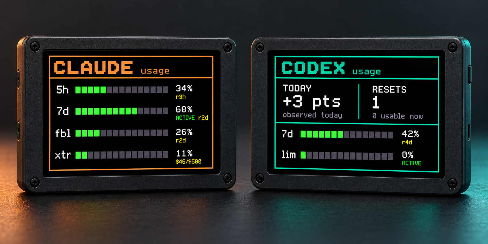
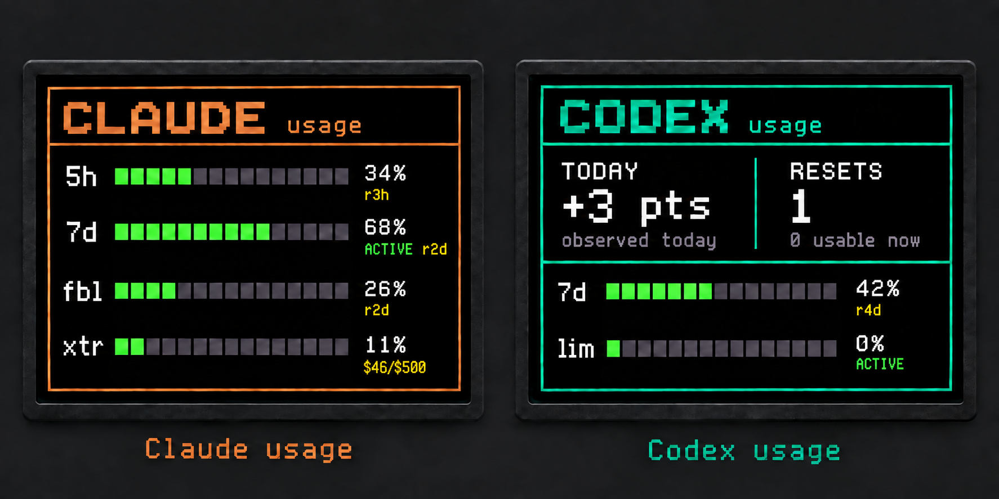

# PyPortal AI Usage

A tiny always-on dashboard for Claude Code and Codex usage, built for the
[Adafruit PyPortal](https://www.adafruit.com/product/4116).



The dashboard alternates between provider views and shows the limits available
for the signed-in accounts: short-term and weekly utilization, reset times,
model-scoped Claude limits, Codex reset credits, and observed daily Codex usage.
Tap the screen to switch views or request a refresh.

## How it works

The PyPortal never receives your Claude or Codex tokens. A small host-side proxy
reads credentials already maintained by Claude Code and Codex, requests usage
data, and exposes only normalized utilization values to the display.

```text
Claude Code credentials ─┐
                         ├─> local usage proxy ─> PyPortal display
Codex auth.json ─────────┘
```

The proxy caches upstream responses for 15 minutes and the device keeps its last
successful response on disk, so the display remains useful during rate limits or
temporary network failures.

> [!IMPORTANT]
> This project uses provider endpoints observed in the Claude Code and Codex
> clients. They are not documented public APIs and may change without notice.
> This project is not affiliated with Anthropic, OpenAI, or Adafruit.

## Requirements

- Adafruit PyPortal running CircuitPython
- A computer on the same trusted network as the device
- Python 3.11 or newer
- Claude Code and/or Codex signed in on that computer
- `mpremote` for USB deployment

The checked-in `devenv` configuration provides Python, `mpremote`, `circup`, and
the project dependencies. A regular Python virtual environment works too.

## Quick start

1. Install the host dependencies.

   ```sh
   python -m venv .venv
   . .venv/bin/activate
   pip install -r requirements.txt
   ```

2. Create the device configuration.

   ```sh
   cp shared/secrets.py.example shared/secrets.py
   ```

   Fill in the Wi-Fi credentials and set `proxy_url` to the LAN address of the
   computer that will run the proxy, for example `http://192.168.1.20:9292`.
   The real file is ignored by Git.

3. Start the proxy.

   ```sh
   python services/usage-server.py
   ```

   By default it listens on `0.0.0.0:9292`. Keep it on a trusted LAN or restrict
   access with the host firewall; normalized usage endpoints are not
   authenticated.

4. Deploy the device files over USB.

   ```sh
   devenv shell -- deploy-shared
   devenv shell -- deploy-secrets
   devenv shell -- deploy usage-dashboard
   ```

   The commands autodetect `/dev/cu.usbmodem*` on macOS and `/dev/ttyACM*` on
   Linux. Set `PYPORTAL_PORT` when autodetection is ambiguous.

5. Install the required CircuitPython libraries and font on the board. The app
   imports `adafruit_requests`, `adafruit_connection_manager`, `adafruit_ntp`,
   `adafruit_esp32spi`, `adafruit_display_text`, `adafruit_bitmap_font`,
   `adafruit_touchscreen`, and `neopixel`. Copy `fonts/usage-ui.bdf` to
   `/fonts/usage-ui.bdf` on `CIRCUITPY`.

## Credential discovery

The proxy reads credentials locally and never returns them in an API response.

Claude lookup order:

1. The macOS `Claude Code-credentials` Keychain item for the current user.
2. `$CLAUDE_AUTH_PATH`.
3. `$CLAUDE_CONFIG_DIR/.credentials.json`, defaulting to
   `~/.claude/.credentials.json`.

Codex defaults to `$CODEX_HOME/auth.json`, with `CODEX_HOME` defaulting to
`~/.codex`. Set `CODEX_AUTH_PATH` to override the full path.

Optional proxy settings:

| Variable | Default | Purpose |
|---|---|---|
| `BIND_HOST` | `0.0.0.0` | Interface used by the proxy |
| `PORT` | `9292` | Proxy port |
| `CLAUDE_KEYCHAIN_SERVICE` | `Claude Code-credentials` | macOS Keychain service |
| `CLAUDE_KEYCHAIN_ACCOUNT` | current user | macOS Keychain account |
| `CLAUDE_KEYCHAIN_PATH` | system default | Optional macOS keychain path |
| `CLAUDE_AUTH_PATH` | see above | Claude credential file |
| `CODEX_AUTH_PATH` | see above | Codex credential file |
| `USAGE_DASHBOARD_STATE_PATH` | XDG state directory | Codex daily baseline file |

## Local API

| Endpoint | Description |
|---|---|
| `GET /health` | Credential availability and cache ages |
| `GET /claude-usage` | Normalized Claude usage |
| `GET /codex-usage` | Normalized Codex usage |
| `GET /all-usage` | Combined payload used by the device |

The proxy does not expose access tokens, refresh tokens, account IDs, or raw
provider responses.

## Screen layout

The display uses the same visual structure for both providers while adapting to
the data each one exposes.



## Development

Run the host-side test suite and compile-check the CircuitPython source:

```sh
devenv shell -- python -m unittest discover -s tests
devenv shell -- python -c 'compile(open("projects/usage-dashboard/code.py").read(), "projects/usage-dashboard/code.py", "exec")'
```

The UI is designed for a 320×240 display and uses a compact bitmap font plus
solid segmented bars to stay readable on the physical panel.

## Security

Read [SECURITY.md](SECURITY.md) before exposing the proxy beyond a trusted local
network. Never commit `shared/secrets.py`, provider credential files, or captured
API responses.

## License

MIT. See [LICENSE](LICENSE).
